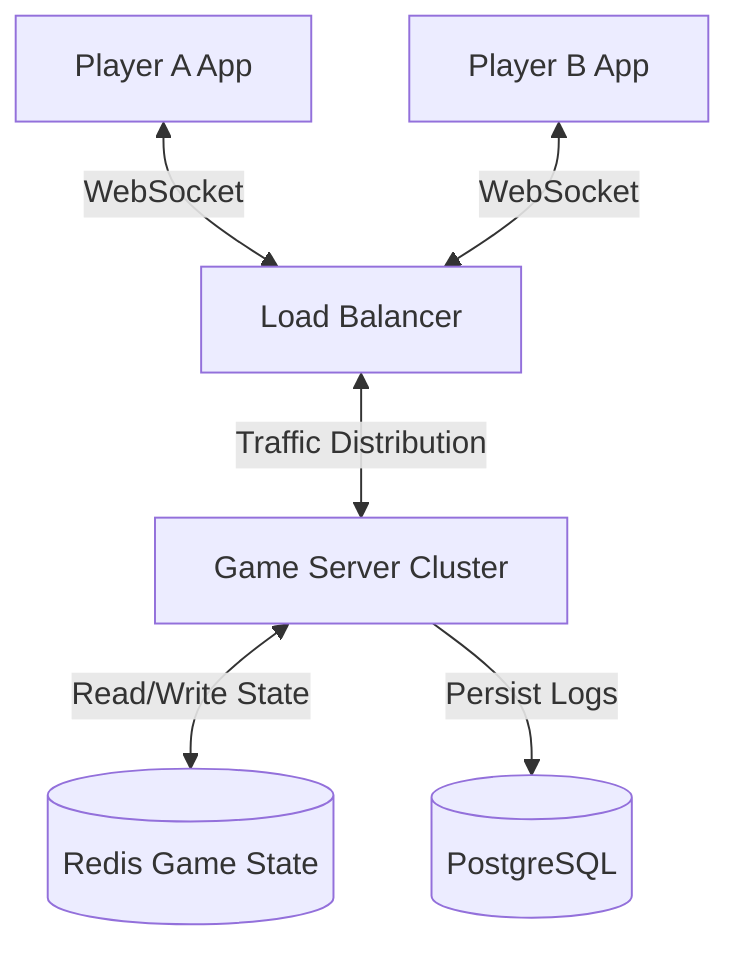

# Party Card: Mobile Game Specification

## 1. High-Level System Architecture

### 1.1 Technology Stack
*   **Mobile Client**: React Native (with Expo) or Flutter
    *   *Rationale*: Cross-platform (iOS/Android), fast development cycle, excellent animation libraries (Reanimated/Flame).
*   **Backend Server**: Node.js (TypeScript) + Socket.IO
    *   *Rationale*: Event-driven architecture perfect for turn-based real-time games.
*   **Database**: Redis (for ephemeral game state) + PostgreSQL (for user stats/persistence if needed later).
    *   *Rationale*: Redis provides sub-millisecond access to game state which is critical for real-time sync.
*   **Infrastructure**: Dockerized containers, hosted on AWS/Google Cloud or a PaaS like Railway/Render.

### 1.2 Architecture Diagram


### 1.3 Communication Protocol
*   **Transport**: WebSocket (WSS)
*   **Format**: JSON payloads
*   **Pattern**: Authoritative Server. Client sends actions (`DRAW_CARD`), Server validates and broadcasts state updates (`GAME_STATE_UPDATE`).

---

## 2. Game State Model

The game state is the single source of truth. All clients simply render this state.

```typescript
type Suit = 'SPADES' | 'HEARTS' | 'DIAMONDS' | 'CLUBS';
type Rank = '10' | 'J' | 'Q' | 'K' | 'A';

interface Card {
  id: string; // unique card id for tracking animations
  suit: Suit;
  rank: Rank;
}

interface Player {
  id: string;
  name: string;
  avatarId: string;
  isHost: boolean;
  isConnected: boolean;
  cards: Card[]; // For Q cards held in hand
  sipsConsumed: number; // For detailed stats
}

type GamePhase = 'LOBBY' | 'PLAYING' | 'GAME_OVER';

interface GameState {
  roomId: string;
  phase: GamePhase;
  players: Player[];
  
  // Game Logic State
  currentTurnPlayerId: string;
  direction: 1 | -1; // 1 for Clockwise, -1 for Counter-Clockwise
  deck: Card[]; // Hidden from clients usually, but tracked on server
  discardPile: Card[]; // Last card is the visible one
  
  // Rule Tracking
  acesDrawnCount: number; // 0-4
  rankCounts: Record<Rank, number>; // Tracks counts for Fire Rule (4 of a kind)
  
  // Temporary States
  pendingAction: 'NONE' | 'WAITING_FOR_DEFENSE' | 'WAITING_FOR_TARGET_SELECTION';
  actionTargetId?: string; // Who is being targeted (e.g., by King)
  lastActionDescription: string; // "Player A drew a King!"
}
```

---

## 3. Multiplayer Sync Strategy

### 3.1 Connection & Room Management
*   **Room Codes**: 4-letter alphanumeric codes (e.g., `PARTY`) for easy sharing.
*   **Heartbeat**: Clients send ping every 3s. Disconnect detected after 10s missed heartbeat.
*   **Reconnection**: Store `socketId` -> `playerId` mapping in Redis. If a player reconnects within 60s, restore their session and hand.

### 3.2 State Synchronization
*   **Delta Compression**: Send full state on join/reconnect. Send partial updates (deltas) for small actions to save bandwidth.
*   **Optimistic UI**: 
    1.  User taps "Draw Card".
    2.  Client immediately plays "draw" animation and shows a rigid placeholder.
    3.  Server processes draw, sends actual card data.
    4.  Client reveals the card face.
*   **Lockstep Handling**: The server maintains a `sequenceId`. Clients ignore updates with older sequence IDs.

---

## 4. UI Screen Breakdown

### 4.1 Splash Screen
*   **Visual**: Neon logo pulsating.
*   **Action**: Background authentication/asset loading.

### 4.2 Home / Lobby
*   **Buttons**: "Create Room", "Join Room".
*   **Join Modal**: Numeric keypad for room code.
*   **Avatar Selection**: Carousel of simple fun characters.

### 4.3 Room Lobby (Waiting)
*   **List**: List of connected players with "Ready" toggles.
*   **Host Controls**: "Start Game" (enabled when >1 players).
*   **Share**: Button to copy room code.

### 4.4 Main Game Board (Landscape)
*   **Center**: 
    *   **Deck**: Face down 3D stack.
    *   **Discard Pile**: Face up, holding the active card.
    *   **Fire/Ace Meters**: Small icons showing progress of Aces (0/4) and current card rank count.
*   **Perimeter**: 
    *   Players arranged in a circle/ellipse.
    *   Active player highlighted with a neon glow/timer ring.
    *   Indicators for `Direction` (arrows rotating).
*   **Player HUD**:
    *   Avatar, Name.
    *   Shield Icon (Q card) if held.
*   **Overlay Actions**:
    *   Big buttons for "Use Shield" or "Select Target" when applicable.

### 4.5 End Screen
*   **Visual**: Explosion of confetti or "Game Over" neon sign.
*   **Stats**: Who drank the most? Who drew the final Ace?
*   **Actions**: "Play Again" (keeps room), "Exit".

---

## 5. Core Game Logic Pseudocode

```javascript
/* SERVER SIDE LOGIC */

function handleDrawCard(roomId, playerId) {
    const state = getGameState(roomId);
    
    // 1. Validation
    if (state.currentTurnPlayerId !== playerId) return Error("Not your turn");
    if (state.phase !== 'PLAYING') return Error("Game not active");

    // 2. Draw Logic
    const card = state.deck.pop();
    state.discardPile.push(card);
    state.rankCounts[card.rank]++;
    
    // 3. Apply Fire Rule (4 of a kind check)
    let penalty = false;
    if (state.rankCounts[card.rank] === 4) {
        assignDrinkPenalty(playerId, "FIRE RULE! 4th " + card.rank);
        penalty = true;
        // Reset count for this rank or keep it? 
        // Typically reset or it triggers every time. Let's say it triggers once.
        state.rankCounts[card.rank] = 0; 
    }

    // 4. Apply Card Effects
    switch (card.rank) {
        case 'A':
            state.acesDrawnCount++;
            if (state.acesDrawnCount >= 4) {
                endGame(roomId, playerId); // Player loses
                return;
            }
            break;
            
        case 'K':
            state.pendingAction = 'WAITING_FOR_TARGET_SELECTION';
            // Turn does NOT advance until target selected
            broadcastUpdate(roomId, state);
            return; 
            
        case 'Q':
            // Give card to player inventory
            getPlayer(state, playerId).cards.push(card);
            // Q doesn't go to discard pile effectively vs drinking, 
            // but for this game logic, let's say it prevents a drink NOW if they had one?
            // Spec says "Can be stored and used later". 
            // So drawing it is safe.
            break;
            
        case 'J':
            state.direction *= -1; // Reverse
            break;
            
        case '10':
            broadcastEvent(roomId, "CENTER_REFILL", "Refill the community cup!");
            break;
    }

    // 5. Advance Turn (if not paused by K or End Game)
    advanceTurn(state);
    broadcastUpdate(roomId, state);
}

function advanceTurn(state) {
    const currentIndex = state.players.findIndex(p => p.id === state.currentTurnPlayerId);
    let nextIndex = (currentIndex + state.direction + state.players.length) % state.players.length;
    state.currentTurnPlayerId = state.players[nextIndex].id;
}
```

---

## 6. Edge Cases & Fail-Safe Handling

1.  **Deck Exhaustion**:
    *   *Issue*: Deck runs out before 4 Aces are found (extremely rare mathematically but possible if shuffled weirdly or cards removed).
    *   *Fix*: Reshuffle discard pile (excluding the top active card) back into the deck.
2.  **Player Disconnects on Turn**:
    *   *Issue*: Player leaves while it's their turn, stalling the game.
    *   *Fix*: Start a 30s timer. If no reconnect, auto-skip their turn or kick them to "Guest" status and remove from cycle.
3.  **Race Conditions**:
    *   *Issue*: Two players dragging a card at once (lag).
    *   *Fix*: Server creates a queue. Request 1 is processed; Request 2 is rejected with "Invalid State".
4.  **"Q" Card Conflict**:
    *   *Issue*: Player tries to use Q to block a drink, but server already processed the penalty.
    *   *Fix*: Implement a `grace_period` (e.g., 3 seconds) after a penalty is assigned where a client can send a `USE_SHIELD` request to cancel it.

---

## 7. Future Expansion Suggestions

1.  **Custom Rule Builder**: Allow hosts to assign different rules to cards (e.g., "7 replaces J", "8 is mate").
2.  **Drinking Minigames**: If a specific card combo appears, pause the card game and launch a quick reaction minigame (e.g., "Tap fastest").
3.  **Shop / Cosmetics**: Unlockable card backs, avatar hats, or confetti effects using in-game currency (earned by playing, not real money to keep it friendly).
4.  **Remote "Cheers"**: Utilize the microphone to detect when everyone yells "Cheers!" to trigger a visual effect.

